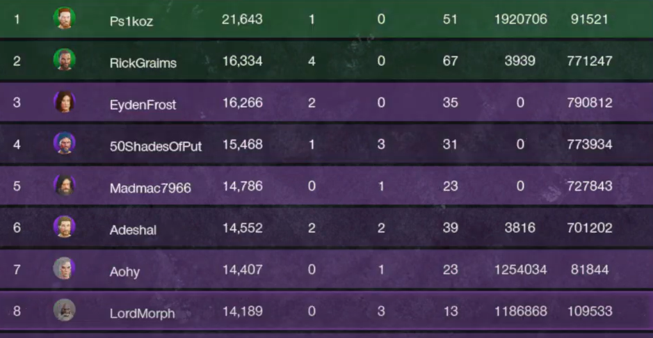

# New World - War Parser

## How Install
First install the python 3.x   

Install requirements.txt
```
pip install -r requirements.txt
```

## How To Use It
Get the prints of war board and put in folder `images` (or create a custom folder)

Configure the vars `image_folder` and `csv` in `main.py` file

And execute for generate scoreboard of wars
```
python3 main.py
```

## How Print the Boards
To achieve a good result, after finishing the war, go to the results page (choose the entire board or your team's or the enemy team's) and click a few times to sort by 'Rank' (sometimes the list bugs out, clicking to sort fixes that) and take screenshots part by part following the order. When taking screenshots, avoid having messages from members leaving the party in the screenshot or you will have to adjust manually later."

Example of screenshot:


## About OCR Used
The OCR used is the PaddleOCR which uses an AI model to identify images, so during the first execution it will download some models to perform the execution.

## Contribute
If you find a bug, please contact me or open one Issue/PR.   
Feel free to contribute to the evolution of the code and if you use it, keep the credits!

### My contacts
Github: http://github.com/AraanBranco   
Email: araanbranco@protonmail.com   

## Support Me
If you liked my work and want to help me in some way, buy me a coffee =)   
Not only do you help me, but you also motivate me to continue with my work!   

[](https://ko-fi.com/L4L6VKCUW)